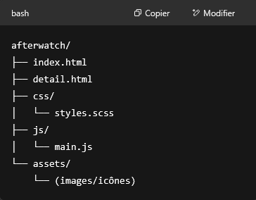

# 🎯 Objectif :

## Créer une version front-end statique du projet, sans PHP ni Symfony, avec :
- HTML pour la structure,
- SCSS pour le style (convertible en CSS),
- JavaScript natif pour l’interactivité.

## 📋 Étapes de réécriture
### 1. Analyse de l’application existante

**Le projet "AfterWatch" semble être une plateforme de gestion de séries/films avec des fonctionnalités comme :**
  - Liste de séries/films à regarder
  - Statistiques de visionnage
  - Fiche série/film
  - Ajout/retrait à une liste

### 2. Architecture proposée



### 3. Fonctionnalités en JavaScript natif
  - Système de recherche
  - Navigation via le menu
  - Interaction avec des listes (ajout/suppression)
  - Stockage local avec localStorage (pour simuler les données utilisateurs)

# 📺 AfterWatch – Suivi Films & Séries

AfterWatch est une interface Web permettant de :
- rechercher des films/séries via TMDb,
- ajouter des titres à votre Watchlist ou Seenlist,
- voir une fiche détaillée (via une modale accessible),
- exporter ou importer vos listes au format JSON.

---

## ✅ Fonctionnalités

### 🔍 Recherche
- Saisie dans la barre de recherche (titre, genre, acteur).
- Si aucun résultat local, consultation de l’API TMDb.
- Résultats affichés dynamiquement.

### ➕ Gestion de Watchlist / Seenlist
- Boutons « Ajouter à la Watchlist » et « Ajouter à la Seenlist » sur chaque carte.
- Suppression possible directement depuis les listes.

### 📁 Export
- Bouton `📁 Exporter mes listes` en bas de page.
- Télécharge un fichier JSON avec les deux listes et une date d’export.

### 📂 Import
- Bouton `📂 Importer mes listes` pour charger un fichier `.json` précédemment exporté.
- Remplace le contenu actuel des listes.

---

## ♿ Accessibilité
- Navigation clavier (modale avec focus piégé).
- Libellés ARIA (`aria-label`, `aria-live`, etc.).
- Responsive à partir de 320px.

---

## 🛠 Dépendances
- Aucune. Fonctionne en HTML/CSS/JS pur.
- API utilisée : [TMDb](https://www.themoviedb.org/)

---

## 🧪 Test local
Utiliser un serveur local pour éviter les problèmes CORS :
```bash
npx serve .
# ou
python3 -m http.server


## 📁 Format d'export

{
  "watchlist": ["Interstellar", "Breaking Bad - Saison 1"],
  "seenlist": ["The Mandalorian"],
  "exportedAt": "2025-05-12T14:32:00.000Z"
}
